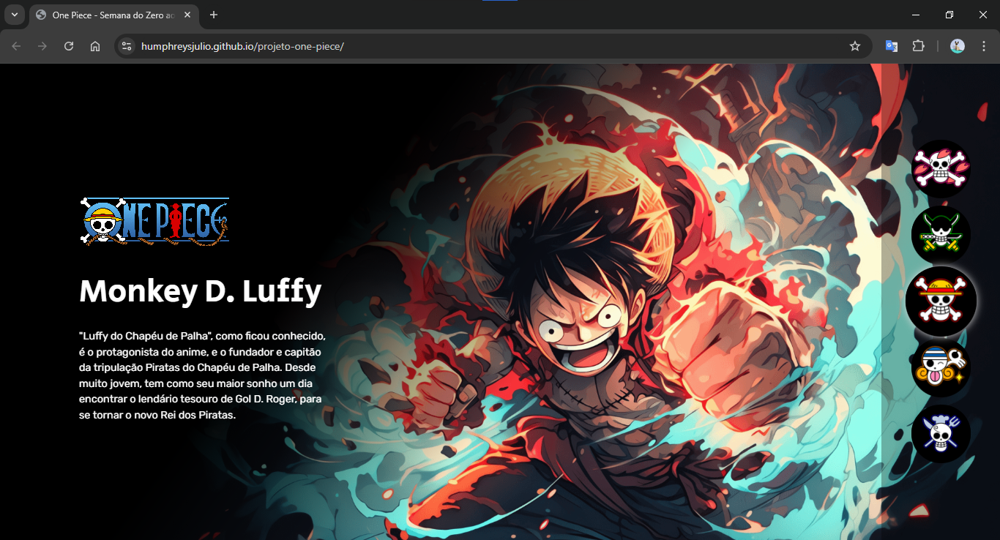
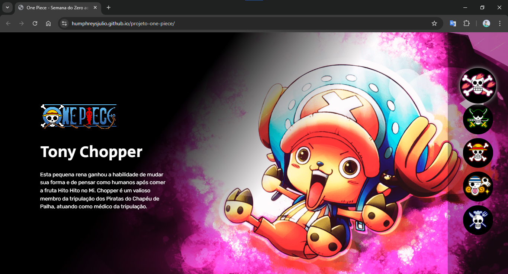
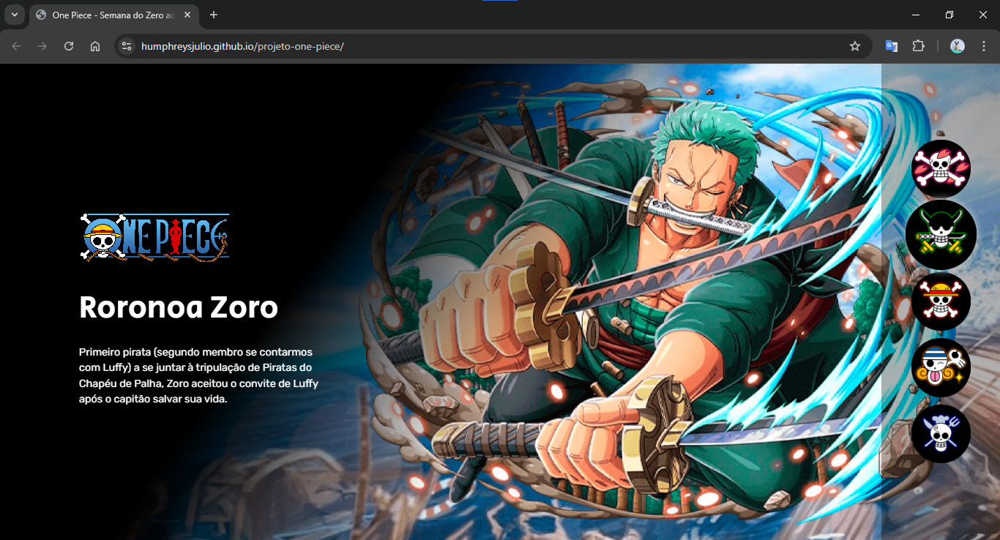
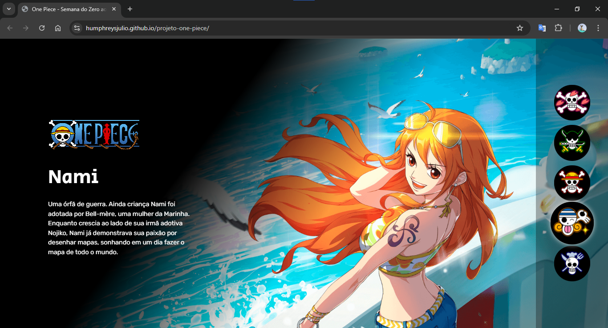
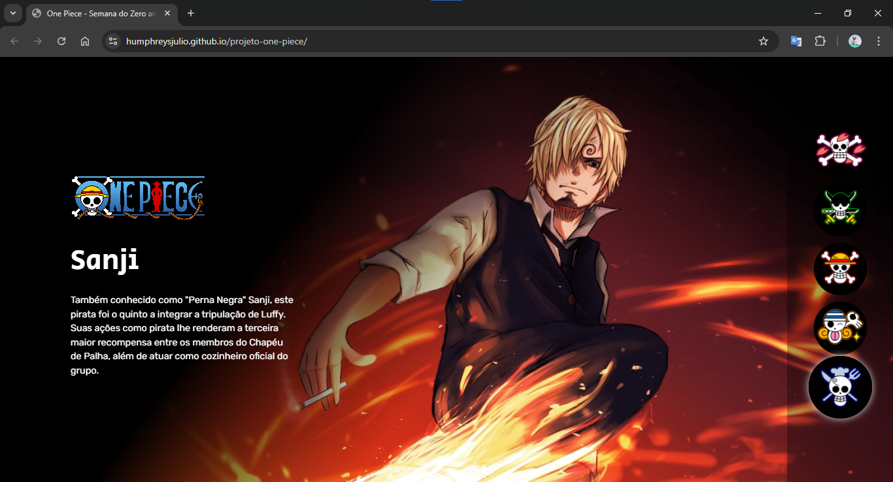
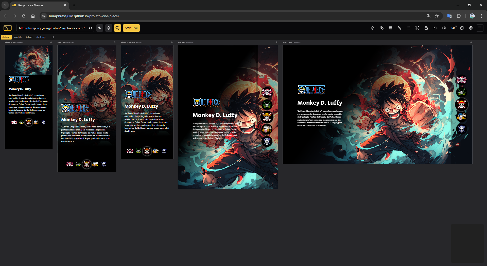

## One Piece Website

## 📝 | Project description
Desenvolvimento de um site responsivo em HTML, CSS e JavaScript voltado para exibir descrições de personagens do anime One Piece através de botões interativos.

Development of a responsive website in HTML, CSS and JavaScript aimed at displaying descriptions of characters from the anime One Piece through interactive buttons.

## 📚 | Stack

  
  
  

## 🛠 | Tools
- Visual Studio Code
- Google Fonts
- Responsive Viewer*

**__Responsive Viewer__* é uma extensão web para facilitar a visualização e teste de sites responsivos. Permite exibir o layout em diferentes resoluções de tela simultaneamente, agilizando o processo de adaptação de interfaces para dispositivos variados.

**__Responsive Viewer__* is a web extension that makes it easier to view and test responsive websites. It allows you to display the layout in different screen resolutions simultaneously, speeding up the process of adapting interfaces to different devices.

## 🖥 | Previews

  
  
  
  
  
  

## 🌎 | Website
https://humphreysjulio.github.io/projeto-one-piece/

## 👨‍💻 | Dev
Julio César Humphreys Reis
